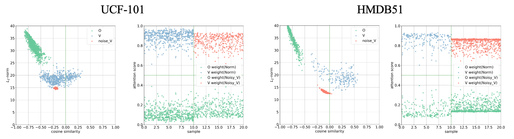

# 1 Evidence for Claims

> Figure 1: The visualization of attention score and average key distribution on CREMA-D, Kinetic-Sound, CMU-MOSEI(V+T), CMU-MOSEI(A+T), UCF-101, HMDB51 datasets, including audio (A), RGB (V), text (T) and optical flow (O) modalities. The left figure for each dataset denotes the average key distribution of different modalities and the red dots represent samples replacing the biased modality by Gaussian noise. The right figure for each dataset reveals the attention score for each modalities with normal or noise inputs. 
# 2 Theory Extension & Verification
## 2.1 Cooperation Dynamics under Different Fusion Paradigm
### 2.1.1 Gradient & Attention

> Figure 2:

### 2.1.2 Adopts QRR for more Fusion Paradigm

| Fusion/Method | Structure | Vanilla MT | Vanilla MT + QRR  |
|:-------------:|:---------:|:----------:|:----:|
| early         | 0+4       |    46.4    |            |
| mid           | 1+3       |    42.3    |            |
| mid           | 2+2       |    41.1    |            |
| late          | 3+1       |    41.4    |            |

> Table 2: Performance of vanilla multimodal transformer (Vanilla MT) across different fusion paradigm.

## 2.2 Gradients Evolution of Unimodal Encoders

> Figure 3: The $L_2$-Norm of gradient of the audio encoder and the visual encoder on CREMA-D and Kinetic-Sound datasets. 

# 3 Method Verification & Validation

## 3.1 Multimodal OOD benchmarks
| OODDataset       |       | HMDB51 (near-OOD)  |                  |       |  UCF101 (far-OOD)  |                  |
| ---------------- | :---: | :----------------: | :--------------: | :---: | :----------------: | :--------------: |
| Metrics          | IDAcc | FRR95 $\downarrow$ | AUROC $\uparrow$ | IDAcc | FRR95 $\downarrow$ | AUROC $\uparrow$ |
| Vanilla MT       | 51.6  |        75.6        |       66.0       | 48.7  |        76.1        |       64.2       |
| Vanilla MT + QRR | 52.3  |        73.9        |       66.3       | 51.0  |        76.1        |       67.2       |

> Table 3: Results on OOD benchmarks with HMDB51 as In-Distribution dataset following the preprocessing and settings of MultiOOD. Use "Vanilla MT" to denote Vanilla Multimodal Transformer. 

## 3.2 Ablation on Attention Score

| Method     | Vanilla MT | QRR   | uni_A | uni_V  |
|:----------:|:----------:|:-----:|:-----:|:------:|
| A (mask V) | 40.1       | 43.1 ($\uparrow$ 3.1) | 47.6  | -      |
| V (mask A) | 14.1       | 14.3 ($\uparrow$ 0.2) | -     | 36.3   |
| - | - | - | - | - |
| origin     | 48.8       | 51.9 | -     | -      |
| AVG        | 46.5 ($\downarrow$ 2.3)      | 51.6 ($\downarrow$ 0.3) | -     | -      |

> Table 4: Ablation on CREMA-D dataset. Mask V refers to force the attention score of visual modality to 0, and vice versa. AVG refers to assign same weight to all of the tokens. Use "Vanilla MT" to denote Vanilla Multimodal Transformer, uni_A and uni_V for only train on uni-modality. 

|   Method   |      Vanilla MT       |           QRR           | uni_A | uni_V |  
| :--------: | :-------------------: | :---------------------: | :---: | :---: |
| A (Mask V) |     46.6    |  47.4  ($\uparrow$ 0.8)       | 53.9  |    -   |   -  |
| V (Mask A) |         40.3   |     42.1 ($\uparrow$ 1.8)  |   -    | 57.0  |   -  |
| - | - | - | - | - |
|   origin   |         67.0          |          69.3           |     -  |   -    |
|    AVG     | 68.2 ($\uparrow$ 1.2) | 69.2 ($\downarrow$ 0.1) |   -    |  -     |  

> Table 5: Ablation on Kinetic-Sound dataset. Mask V refers to force the attention score of visual modality to 0, and vice versa. AVG refers to assign same weight to all of the tokens. Use "Vanilla MT" to denote Vanilla Multimodal Transformer, uni_A and uni_V for only train on uni-modality. 

> 
# 4 Ablation and Performance Validation
## 4.1 Ablation on Batch Size
| Batch Size | Vanilla MT | Vanilla MT + QRR | 
| :--------: | :--------: | :--------------: | 
|     16     |    49.1    |       50.6       | 
|     64     |    48.8    |       52.2       |  
|    256     |    47.8    |       48.5       |  

> Table 6: Abaltion on different batch size on CREMA-D dataset. The accuracy are given under the methods. 
## 4.2 Consistent Improvements

| Dataset | CREMA-D      | Kinetic-Sound  |
|:-------:|:------------:|:--------------:|
| coef    | 0.765        | 0.698          |
| p-value | 0.001 < 0.01 | 0.003 < 0.01   |

> Table 7: To prove that QRR is statistically meaningful, experiments on CREMA-D and Kinetic-Sound dataset are conducted ten times with different random seeds and calculate the pearson correlation coefficient.

# 5 "Simple yet Effective"
| Complexity      | Acc  | Parameters | GFLOPs    |
|:---------------:|:----:|:----------:|:---------:|
| Vanilla MT      | 48.8 | 59.87M     | 1489.13   |
| MBT             | 51.5 ($\uparrow$ 2.7)| 114.21M ($\uparrow$ 90.8%)   | 2746.90 ($\uparrow$ 84.5%)   |
| MMML            | **52.0\***   ($\uparrow$ 3.2)| 77.88M ($\uparrow$ 30.1%)   | 1828.29 ($\uparrow$ 22.8%)   |
| JMT             | 50.7 ($\uparrow$ 1.9)| 62.23M ($\uparrow$ 3.9%)    | 1494.87 ($\uparrow$ 0.4%)  |
| Vanilla MT+QRR  | **51.9** ($\uparrow$ 3.1) | 60.46M ($\uparrow$ **1.0%**)    | 1489.20 ($\uparrow$ **0.1%**) |

> Table 8: The parameter and time complexity analysis on CREMA-D and Kinetic-Sound dataset. The GFLOPs is obtained from the thop library.
